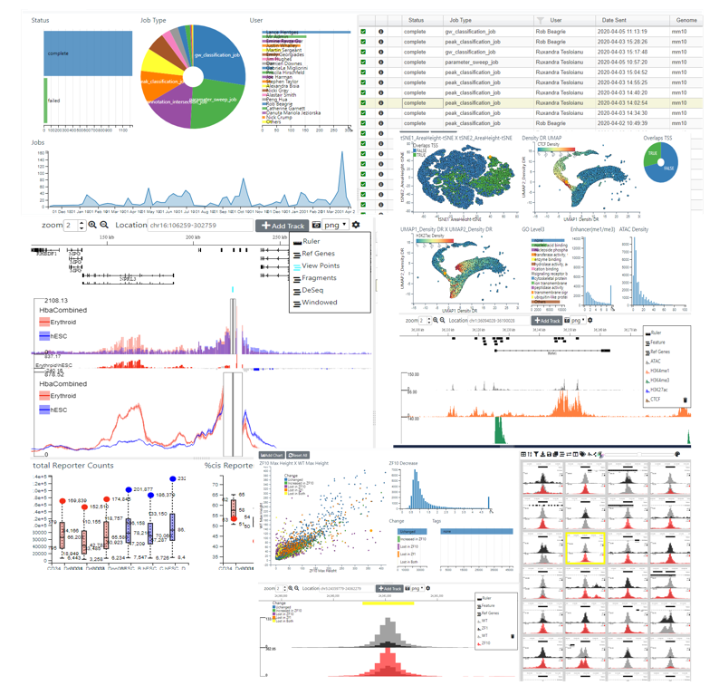

# Multi Locus View

Multi Locus View (MLV) is a web based tool for analysing and visualising Next Generation Sequencing data sets.
By allowing intuitive filtering and visualisation of multiple genomic locations, it allows the user to quickly drill
down and annotate regions of interest. A Public version can be accessed [here](https://mlv.molbiol.ox.ac.uk)

## Documentation

 * [Developer](https://lanceotron.readthedocs.io/en/latest/mlv_developer/developer.html) How to install MLV and extend its functionality
 * [User](https://lanceotron.readthedocs.io/en/latest/multi_locus_view/multi_locus_view.html) How to visualise CHiP-seq/ATAC data
 
## Other Applications Built on MLV
MLV is extensible and applications (modules) can be developed independently.
Two other applications which use MLV are:-

* [LanceOtron](https://lanceotron.molbiol.ox.ac.uk/) - Machine Learning to call peaks in CHiP-seq data. 
* [CaptureSee](https://capturesee.molbiol.ox.ac.uk/) - Visualisation of highly multiplexed CaptureSee experiments.

## Stand Alone JavaScript
MLV utilises two stand alone JavaScript components that can be embedded in other applicatons

* [CIView](https://github.com/Hughes-Genome-Group/CIView) - Cross Filter Image Viewer.  Interactive charts, tables and images
* [MLVPanel](https://github.com/Hughes-Genome-Group/MLVPanel) - Lightwight, extensible  embedable genome browser designed to for showing multiple locations simultaneously

